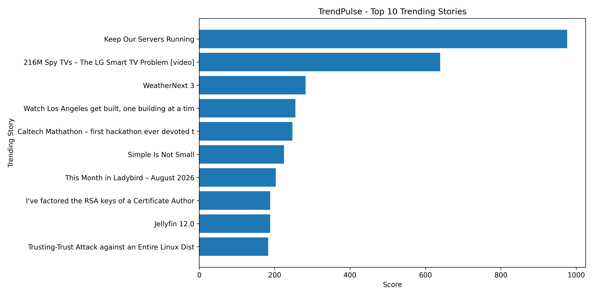

# trendpulse-Sindha_asmar

# TrendPulse

## 📊 Real-Time Trending Data Collection and Analysis

TrendPulse is a Python-based data collection, processing, analysis, and visualization project. It collects trending stories from the Hacker News API, processes and cleans the collected data, analyzes the trending information, and creates a visualization of the top 10 trending stories.

## 🎯 Project Objective

The main objective of TrendPulse is to demonstrate how real-time trending data can be collected from an online API and transformed into useful information through data processing, analysis, and visualization.

## 🚀 Features

- Collects top trending stories
- Stores collected data in CSV format
- Removes duplicate and missing records
- Cleans and processes the data
- Calculates basic statistics
- Finds the highest-scoring trending story
- Identifies the top 10 trending stories
- Creates a bar chart visualization
- Saves analysis results for further use

## 🛠️ Technologies Used

- Python
- Pandas
- Requests
- Matplotlib
- Hacker News API
- CSV

## 📊 Project Visualization

The following chart shows the top 10 trending stories collected and analyzed by TrendPulse.

## 📁 Project Structure

TrendPulse
│
├── README.md                  ← Documentation
├── requirements.txt           ← Python dependencies
├── .gitignore
│
├── task1_data_collection.py   ← Collect data
├── task2_data_processing.py   ← Clean data
├── task3_data_analysis.py     ← Analyze data
├── task4_visualization.py     ← Create chart
│
├── trending_data.csv
├── processed_trending_data.csv
├── analysis_results.csv
└── top_10_trending_stories.png 